As subteam lead, I guide the design and delivery of all primary rocket structures and interfaces for McGill’s competitive launches. This includes everything from airframe composite manufacturing, internal structure design, composite tank development, to post processing and assembly. My role balances technical modeling, detailed FEA, hands-on prototyping, and training/mentoring our group of over 50 engineering students.

My biggest contribution to the team is connecting classroom knowledge with real aerospace manufacturing—scoping objectives, leading brainstorming and modeling in Siemens NX, validating important designs, and coordinating everything from composite layups to mechanical assembly/test.

We iteratively improved our core designs, all of which had to be both light and manufacturable. Our latest coupling ring, for example, solves alignment issues for assembly and dramatically shortens build times. Process improvements and careful QA have cut scrap and unpredictable failures.

Through these projects, I’ve learned how to:
- Direct a large multidisciplinary team (communication and clear planning are as important as technical skills)
- Push topology optimization and structural design
- Manage sponsor expectations and budget/funding for research, competitions, and tooling
- Guide composite layup and post-processing to aerospace QA standards
- Analyze joints for both concentricity and force distribution, using nonlinear FEA
- Deliver documents and technical presentations to external judges, sponsors, and the university

### Featured CADs and Analysis

Below are part of the elements that I have worked on.

- **Coupling System**
  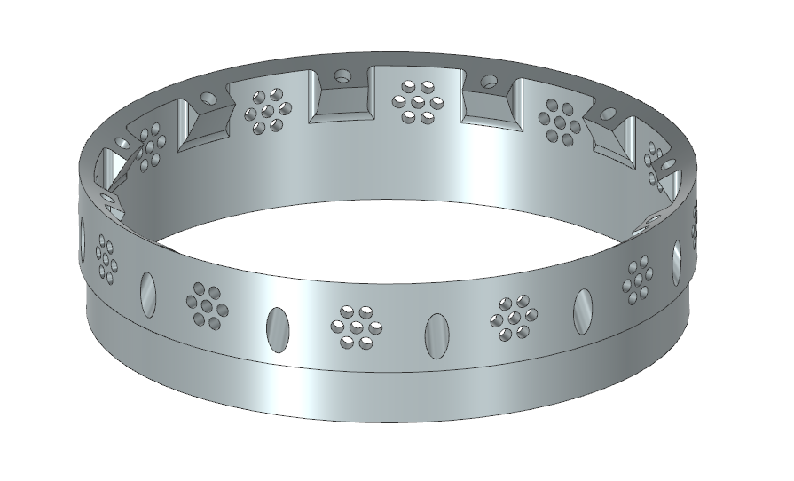 
  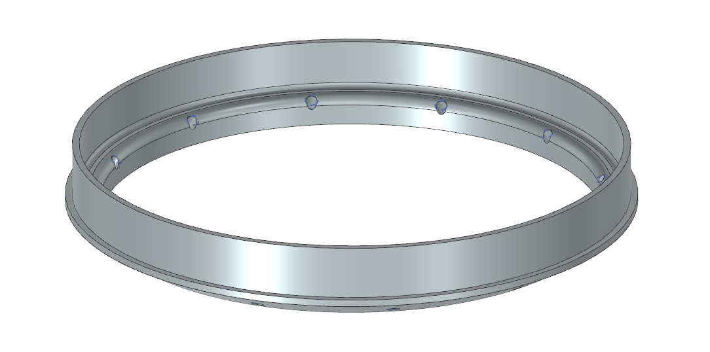 
  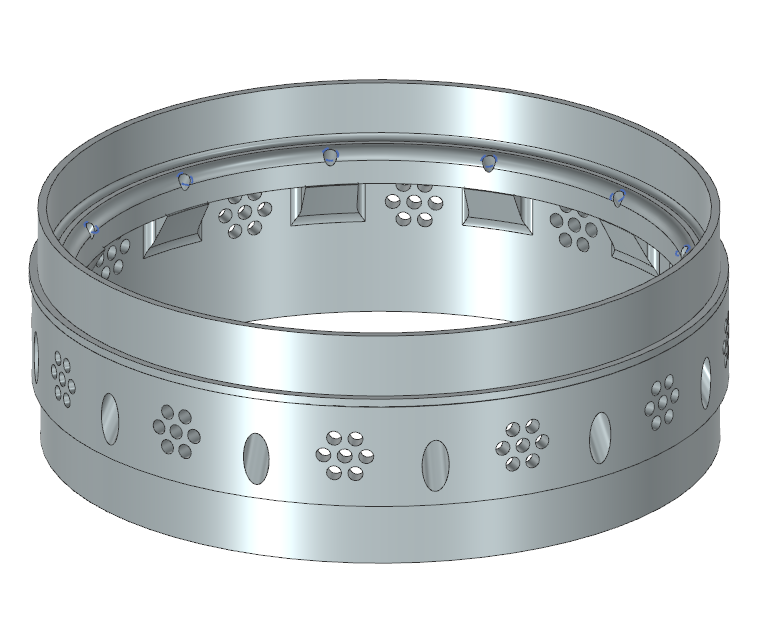
  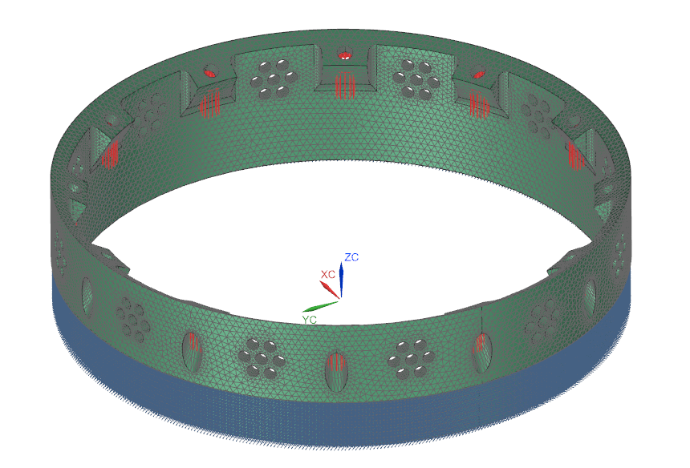 
  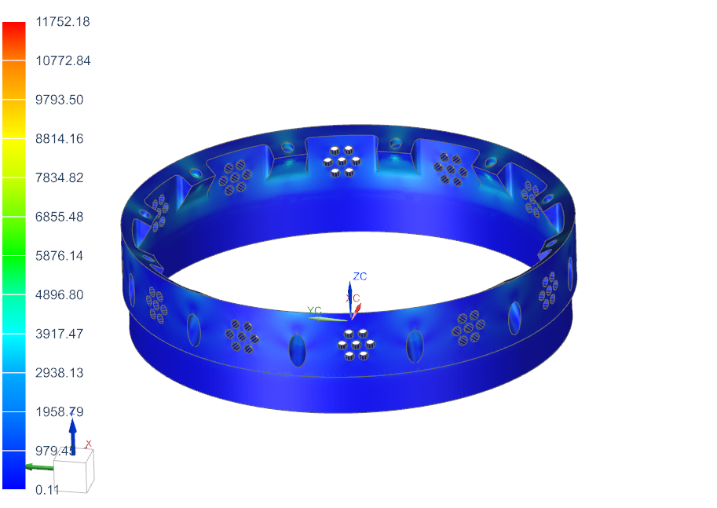 
  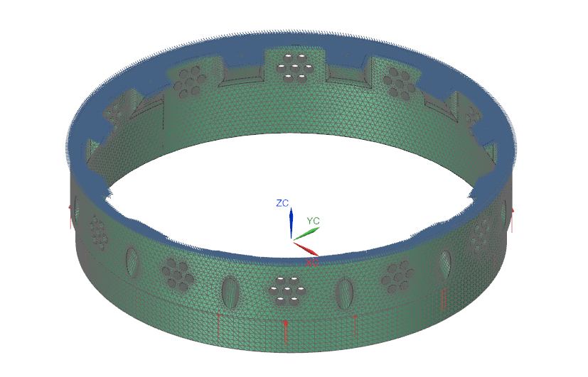  
  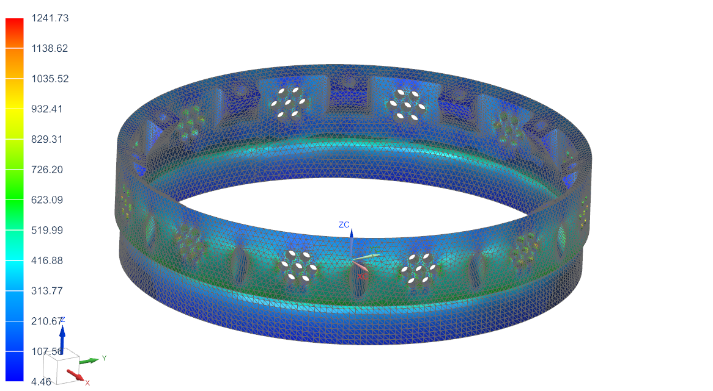

- **AV Plate**  
  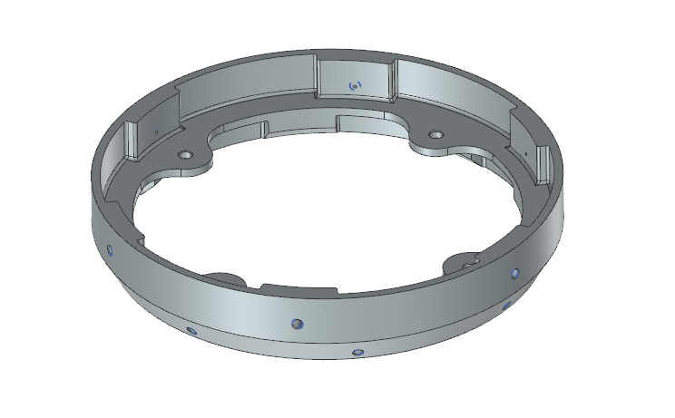
  

- **AV Bay**  
  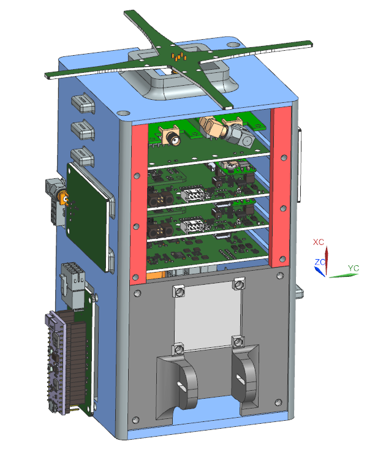
  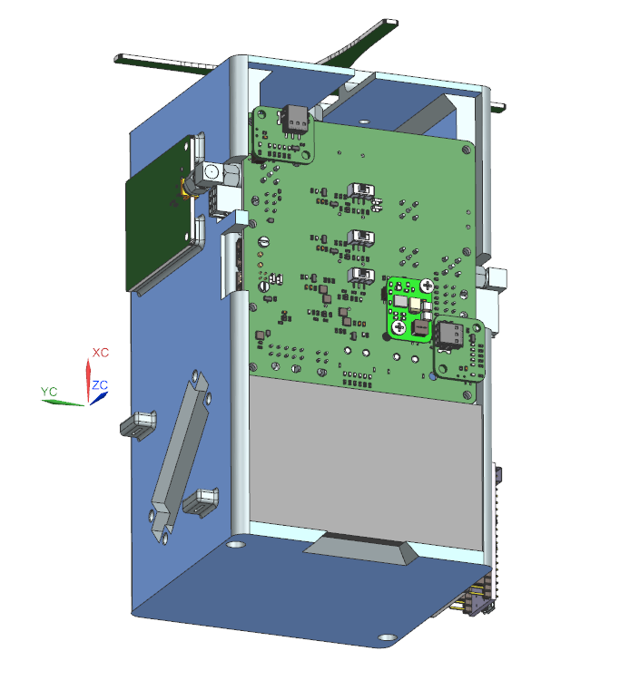
  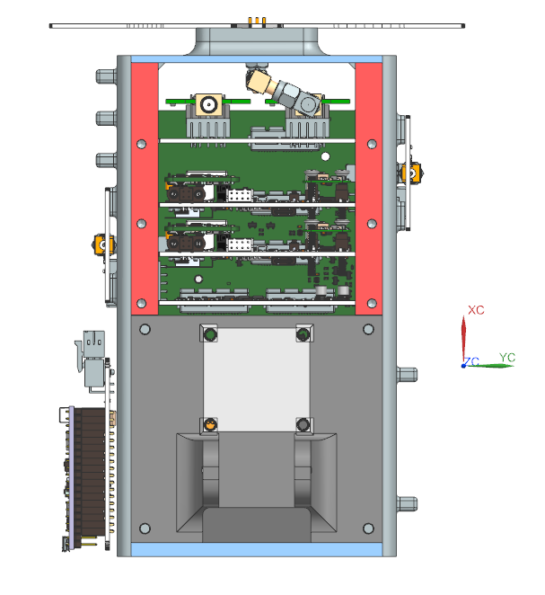
  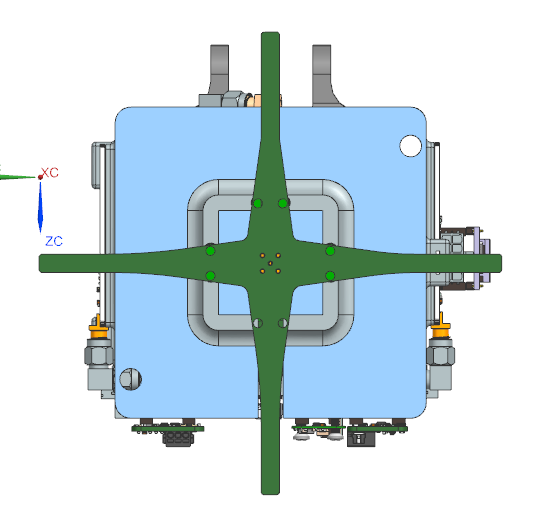

- **Radax**  
  
  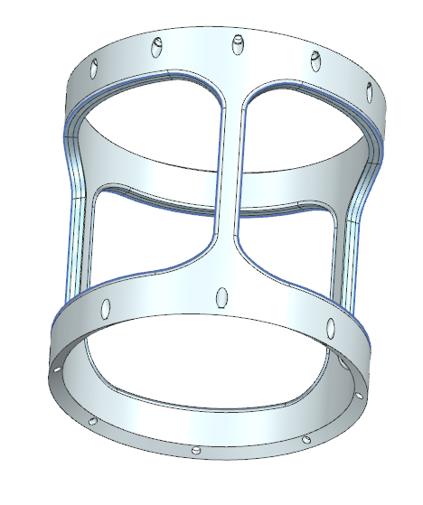

- **Tank Stand**  
  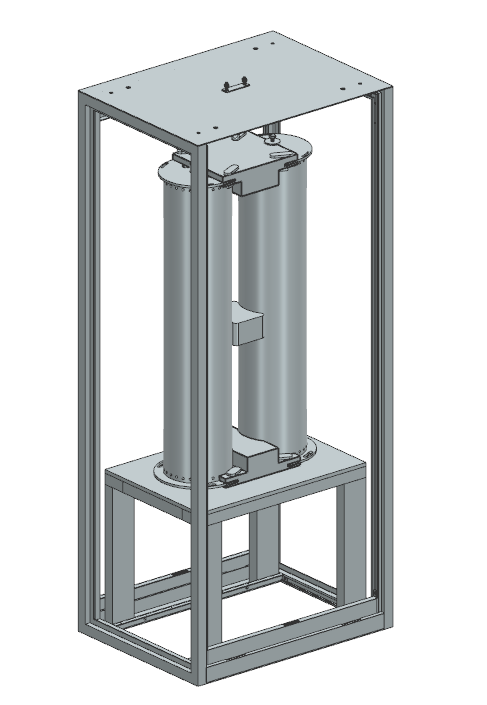
  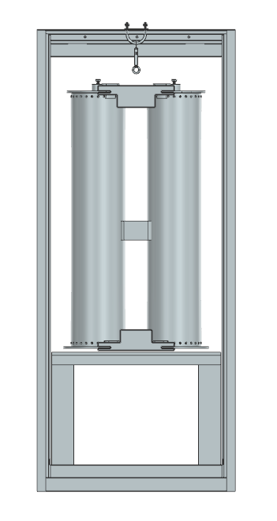

---
